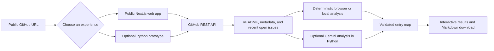

# First Contribution Map

**Understand a repository. Find your first meaningful pull request.**

[Launch the public app](https://samu998676.github.io/First-Contribution-Map/) · [Watch the 49-second HD overview](https://samu998676.github.io/First-Contribution-Map/media/first-contribution-map-overview.mp4) · [Report an issue](https://github.com/samu998676/First-Contribution-Map/issues)

[](https://samu998676.github.io/First-Contribution-Map/media/first-contribution-map-overview.mp4)

First Contribution Map turns a public GitHub repository into a newcomer-friendly entry map. It explains what the project does, outlines its likely architecture and seams, and highlights three beginner-oriented candidates, with clearly labeled placeholders when fewer open issues are available.

| Challenge | Solution | Outcome |
| --- | --- | --- |
| New contributors face a large codebase, unfamiliar terminology, and an issue list with no obvious starting point. | Review the repository's public README, metadata, and recent open issues as one focused onboarding flow. | Spend less time decoding context and start a useful, appropriately scoped contribution with more confidence. |

### What the map includes

- A plain-language project summary.
- A qualified architecture overview based on the available documentation.
- Likely component boundaries and seams worth exploring.
- Three beginner-oriented issue candidates grounded in recent open issues.
- A reason, useful skills, and a concrete first action for each candidate.
- A downloadable Markdown report for notes or sharing.

> **Project status:** Working POC with a public GitHub Pages deployment. Recommendations use limited public context and should be confirmed with repository maintainers before work begins.

## Use the public app

The fastest path requires no account, sign-in, API key, or installation:

1. Open **[First Contribution Map](https://samu998676.github.io/First-Contribution-Map/)**.
2. Select **View guided demo**, or paste the URL of any public GitHub repository.
3. Select **Generate contribution map**.
4. Review the summary, likely architecture, seams, and three candidate cards.
5. Download the Markdown map or open a candidate issue on GitHub.

The browser app uses public GitHub data, runs deterministic analysis in the browser, and never clones or writes to a repository. The guided demo uses a bundled snapshot and makes no network request.

To analyze a live project, paste a URL such as:

```text
https://github.com/streamlit/streamlit
```

Repository subpages such as `/issues` or `/tree/main` are also accepted. Only public GitHub repositories are supported.

## Two implementations, one workflow

| Implementation | Best for | Credentials |
| --- | --- | --- |
| **Public Next.js app** in `site/` | Trying the product immediately and sharing a public link | None; it uses anonymous public GitHub requests |
| **Optional Python/Streamlit prototype** in `app.py` and `src/` | Local development, Gemini-assisted analysis, and higher GitHub API limits | Optional `GEMINI_API_KEY` and `GITHUB_TOKEN`, stored only in the local environment |

## How it works



The app never clones the repository and never writes to GitHub. Pull requests returned by GitHub's issues endpoint are excluded.

## Main features

| Feature | What it provides |
| --- | --- |
| Project summary | A concise explanation of the repository's purpose based on supplied public context. |
| Architecture map | Likely components and seams inferred from the README. |
| Beginner issue ranking | Three candidate cards; real recommendations are grounded in recent open issues and missing slots are labeled placeholders. |
| Actionable guidance | A reason, likely skills, and a suggested first action for every recommendation. |
| Two analysis options | The public app uses deterministic analysis; the optional Python prototype can add Gemini-assisted analysis. |
| Guided demo | A network-free example that is ready immediately. |
| Markdown export | A downloadable contribution map for notes or sharing. |
| Safe URL handling | User input is validated and requests are limited to GitHub's API. |

## Optional Python + Gemini prototype

The repository also includes the original Python/Streamlit implementation. Use it when you want Gemini-generated analysis, a GitHub token for higher API limits, or local development of the Python analysis pipeline.

### Requirements

- Python 3.11, 3.12, or 3.13
- `pip`
- Internet access for live GitHub repositories
- Optional: a Gemini API key for model-generated analysis
- Optional: a GitHub personal access token for a higher API request limit

### macOS or Linux

```bash
git clone https://github.com/samu998676/First-Contribution-Map.git
cd First-Contribution-Map
python3 -m venv .venv
source .venv/bin/activate
python -m pip install --upgrade pip
pip install -r requirements.txt
cp .env.example .env
streamlit run app.py
```

### Windows PowerShell

```powershell
git clone https://github.com/samu998676/First-Contribution-Map.git
cd First-Contribution-Map
py -m venv .venv
.venv\Scripts\Activate.ps1
python -m pip install --upgrade pip
pip install -r requirements.txt
Copy-Item .env.example .env
streamlit run app.py
```

Open the local URL displayed by Streamlit, normally `http://localhost:8501`.

### Configuration

The app works without credentials. Add values to the local `.env` file only when you need the corresponding capability:

```dotenv
GEMINI_API_KEY=
GITHUB_TOKEN=
GEMINI_MODEL=gemini-3.7-flash
```

| Variable | Required? | Purpose |
| --- | --- | --- |
| `GEMINI_API_KEY` | No | Enables Gemini-generated summaries, architecture insights, and issue ranking. Create a key in [Google AI Studio](https://aistudio.google.com/apikey). |
| `GITHUB_TOKEN` | No | Increases the GitHub API request limit for live analysis. Anonymous access is sufficient for light use. |
| `GEMINI_MODEL` | No | Overrides the configured Gemini model. The code currently defaults to `gemini-3.7-flash`. |

Do not commit `.env`, `.streamlit/secrets.toml`, API keys, or access tokens. The secret files are ignored, but never place credentials in another tracked file.

### Analysis modes

- **Guided demo:** Uses bundled data and never makes a network request.
- **Local analysis:** Fetches public repository context from GitHub and ranks issues with deterministic heuristics.
- **Gemini analysis:** Sends the bounded README and issue context to the configured Gemini model and validates its structured response.
- **Local fallback:** Automatically returns a local result if Gemini is unavailable or returns an invalid response.

If a repository has fewer than three usable open issues, the app creates clearly labeled local placeholders rather than inventing GitHub issue numbers.

### Using the Python app

1. Paste a public GitHub repository URL.
2. Select **Generate contribution map**.
3. Review the project summary, likely architecture, component seams, and three candidate cards.
4. Open an issue on GitHub to confirm that it is current and unclaimed.
5. Read the project's `CONTRIBUTING.md` and communicate with maintainers before starting a substantial change.
6. Use **Download map** to save the result as Markdown.

## Public GitHub Pages deployment

The account-free browser version lives in `site/` and is deployed automatically by `.github/workflows/pages.yml` whenever `main` changes. The deployment builds a static Next.js export, so GitHub Pages does not need a server or application secrets.

To reproduce the static build locally:

```bash
cd site
npm ci
npm run build:pages
```

The deployable output is written to `site/out/`.

### Optional Python deployment

The Python prototype can also be deployed to a compatible Python hosting service. Use `app.py` as the entry point and configure `GEMINI_API_KEY`, `GITHUB_TOKEN`, and `GEMINI_MODEL` as server-side secrets when needed. The public GitHub Pages app is the canonical deployment for this repository.

## Project structure

```text
First-Contribution-Map/
├── .github/workflows/
│   └── pages.yml             # Automatic public GitHub Pages deployment
├── app.py                    # Optional Python/Streamlit interface
├── assets/
│   └── styles.css            # Application styling
├── src/
│   ├── analyzer.py           # Gemini prompt, validation, and local fallback
│   ├── demo_data.py          # Bundled network-free demo context
│   └── github_client.py      # GitHub URL validation and API client
├── tests/                    # Analyzer, GitHub client, and UI tests
├── site/                     # Public Next.js browser application
│   └── public/media/         # HD overview video, poster, and captions
├── .streamlit/
│   └── config.toml           # Streamlit theme and server defaults
├── .env.example              # Optional configuration template
├── requirements.txt          # Runtime dependencies
└── requirements-dev.txt      # Test dependencies
```

## Development and testing

Install the Python development dependencies and run the test suite:

```bash
pip install -r requirements-dev.txt
pytest
```

The tests cover repository URL parsing, successful GitHub response handling and pull-request filtering, deterministic analysis, placeholder behavior, a core schema invariant, and basic Streamlit flows.

Validate the public website separately:

```bash
cd site
npm ci
npm run lint
npm run build:pages
```

## Troubleshooting

### GitHub rate limit reached

The public browser app intentionally uses anonymous GitHub API access; wait for the limit to reset if it is reached. For the optional Python prototype, you can instead add a valid `GITHUB_TOKEN` to the local `.env` file. Never place a token in the browser application or commit it to Git.

### Repository cannot be accessed

Confirm that the URL points to `github.com/owner/repository` and that the repository is public. Private repositories are intentionally rejected.

### Gemini is unavailable

This applies only to the optional Python prototype. Check `GEMINI_API_KEY` and `GEMINI_MODEL`; the Python app will normally show a local fallback map so the workflow can continue.

### Fewer than three real issue recommendations

The repository may not have enough recent open issues. The app labels placeholder suggestions clearly and never presents them as real GitHub issues.

### The architecture does not match the codebase

The POC infers architecture from the README and repository metadata; it does not inspect the complete file tree. Treat the map as orientation, then verify it against the source and project documentation.

## Privacy and safety

- Only public GitHub metadata, README content, and recent open issues are fetched.
- Repository URLs are validated before any request is made.
- Private repositories are not supported.
- Repositories are not cloned or modified.
- README and issue text are treated as untrusted data inside the Gemini prompt.
- Input is bounded and truncated before model analysis.
- Generated issue recommendations are validated against the supplied GitHub issues.
- Credentials are read from environment variables and are not displayed in the app.

## POC limitations

- Architecture is inferred from documentation, not from full source-code analysis.
- Beginner suitability is a recommendation, not a guarantee of scope or maintainer acceptance.
- Only the README and up to ten recent open issues are considered.
- GitHub's anonymous API limit can affect live use.
- Model output can still be incomplete or inaccurate despite schema and grounding checks.
- This repository does not currently include a software license.

## Contributing

Contributions are welcome. A simple workflow is:

1. Fork the repository.
2. Create a focused branch.
3. Make and test your change.
4. Run the relevant Python tests and/or website checks.
5. Open a pull request that explains the problem, the solution, and how it was verified.

Good POC follow-up ideas include full file-tree analysis, configurable issue filters, contribution-readiness scoring, caching, accessibility checks, and richer deployment documentation.

## License

No open-source license has been selected yet. Until one is added, standard copyright rules apply; review the repository's license status before reusing or redistributing the code.
