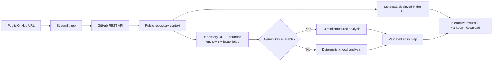

# First Contribution Map

First Contribution Map is a Streamlit proof of concept that helps developers understand an unfamiliar open-source project before making their first contribution.

Paste a public GitHub repository URL and the app turns the repository's README, metadata, and recent open issues into a practical entry map:

- A plain-language summary of what the project does.
- A likely architecture overview and the main component boundaries.
- Three candidate cards drawn from open issues, with clearly labeled placeholders when a repository has too few issues.
- A reason each real issue is approachable, the skills involved, and a concrete first step.
- A Markdown report that can be downloaded and shared.

> **Project status:** Working POC. Recommendations are generated from limited public context and should be confirmed with the repository maintainers before work begins.

## Public website

Open **[First Contribution Map](https://samu998676.github.io/First-Contribution-Map/)** in any modern browser. The GitHub Pages version is public and requires no account, sign-in, API key, or installation.

The public website reads public repository metadata, README content, and recent open issues directly from GitHub. It performs deterministic analysis in the browser and never clones or writes to the repository.

## Try it in two minutes

For the quickest start, open the [public website](https://samu998676.github.io/First-Contribution-Map/) and select **View guided demo**. To run the Python/Streamlit version locally without an API key or internet access:

1. Start the app with `streamlit run app.py`.
2. Open the local address shown in the terminal.
3. Select **View demo**.

The demo uses a bundled repository snapshot and deterministic local analysis. Nothing is sent to GitHub or Gemini.

To analyze a live project, paste a URL such as:

```text
https://github.com/streamlit/streamlit
```

Repository subpages such as `/issues` or `/tree/main` are also accepted. Only public GitHub repositories are supported.

## How it works



The app never clones the repository and never writes to GitHub. Pull requests returned by GitHub's issues endpoint are excluded.

## Main features

| Feature | What it provides |
| --- | --- |
| Project summary | A concise explanation of the repository's purpose based on supplied public context. |
| Architecture map | Likely components and seams inferred from the README. |
| Beginner issue ranking | Three candidate cards; real recommendations are grounded in recent open issues and missing slots are labeled placeholders. |
| Actionable guidance | A reason, likely skills, and a suggested first action for every recommendation. |
| Gemini and local modes | Gemini provides richer analysis; the deterministic fallback keeps the app useful without a key. |
| Guided demo | A network-free example that is ready immediately. |
| Markdown export | A downloadable contribution map for notes or sharing. |
| Safe URL handling | User input is validated and requests are limited to GitHub's API. |

## Local setup

### Requirements

- Python 3.11, 3.12, or 3.13
- `pip`
- Internet access for live GitHub repositories
- Optional: a Gemini API key for model-generated analysis
- Optional: a GitHub personal access token for a higher API request limit

### macOS or Linux

```bash
git clone https://github.com/samu998676/First-Contribution-Map.git
cd First-Contribution-Map
python3 -m venv .venv
source .venv/bin/activate
python -m pip install --upgrade pip
pip install -r requirements.txt
cp .env.example .env
streamlit run app.py
```

### Windows PowerShell

```powershell
git clone https://github.com/samu998676/First-Contribution-Map.git
cd First-Contribution-Map
py -m venv .venv
.venv\Scripts\Activate.ps1
python -m pip install --upgrade pip
pip install -r requirements.txt
Copy-Item .env.example .env
streamlit run app.py
```

Open the local URL displayed by Streamlit, normally `http://localhost:8501`.

## Configuration

The app works without credentials. Add values to the local `.env` file only when you need the corresponding capability:

```dotenv
GEMINI_API_KEY=
GITHUB_TOKEN=
GEMINI_MODEL=gemini-3.7-flash
```

| Variable | Required? | Purpose |
| --- | --- | --- |
| `GEMINI_API_KEY` | No | Enables Gemini-generated summaries, architecture insights, and issue ranking. Create a key in [Google AI Studio](https://aistudio.google.com/apikey). |
| `GITHUB_TOKEN` | No | Increases the GitHub API request limit for live analysis. Anonymous access is sufficient for light use. |
| `GEMINI_MODEL` | No | Overrides the configured Gemini model. The code currently defaults to `gemini-3.7-flash`. |

Do not commit `.env`, `.streamlit/secrets.toml`, API keys, or access tokens. The secret files are ignored, but never place credentials in another tracked file.

### Analysis modes

- **Guided demo:** Uses bundled data and never makes a network request.
- **Local analysis:** Fetches public repository context from GitHub and ranks issues with deterministic heuristics.
- **Gemini analysis:** Sends the bounded README and issue context to the configured Gemini model and validates its structured response.
- **Local fallback:** Automatically returns a local result if Gemini is unavailable or returns an invalid response.

If a repository has fewer than three usable open issues, the app creates clearly labeled local placeholders rather than inventing GitHub issue numbers.

## Using the app

1. Paste a public GitHub repository URL.
2. Select **Generate contribution map**.
3. Review the project summary, likely architecture, component seams, and three candidate cards.
4. Open an issue on GitHub to confirm that it is current and unclaimed.
5. Read the project's `CONTRIBUTING.md` and communicate with maintainers before starting a substantial change.
6. Use **Download map** to save the result as Markdown.

## Deploy on Streamlit Community Cloud

1. Push this repository to GitHub.
2. Sign in at [Streamlit Community Cloud](https://share.streamlit.io/).
3. Create an app and select this repository.
4. Choose the `main` branch and set the entry point to `app.py`.
5. In **Advanced settings → Secrets**, add any optional credentials as root-level TOML values:

   ```toml
   GEMINI_API_KEY = "your-key"
   GITHUB_TOKEN = "your-token"
   GEMINI_MODEL = "gemini-3.7-flash"
   ```

6. Select **Deploy**.

The app can be deployed without secrets; it will use anonymous GitHub requests and local analysis.

## Public GitHub Pages deployment

The account-free browser version lives in `site/` and is deployed automatically by `.github/workflows/pages.yml` whenever `main` changes. The deployment builds a static Next.js export, so GitHub Pages does not need a server or application secrets.

To reproduce the static build locally:

```bash
cd site
npm ci
npm run build:pages
```

The deployable output is written to `site/out/`.

## Project structure

```text
First-Contribution-Map/
├── .github/workflows/
│   └── pages.yml             # Automatic public GitHub Pages deployment
├── app.py                    # Streamlit interface and result rendering
├── assets/
│   └── styles.css            # Application styling
├── src/
│   ├── analyzer.py           # Gemini prompt, validation, and local fallback
│   ├── demo_data.py          # Bundled network-free demo context
│   └── github_client.py      # GitHub URL validation and API client
├── tests/                    # Analyzer, GitHub client, and UI tests
├── site/                     # Account-free browser application
├── .streamlit/
│   └── config.toml           # Streamlit theme and server defaults
├── .env.example              # Optional configuration template
├── requirements.txt          # Runtime dependencies
└── requirements-dev.txt      # Test dependencies
```

## Development and testing

Install the development dependencies and run the test suite:

```bash
pip install -r requirements-dev.txt
pytest
```

The tests cover repository URL parsing, successful GitHub response handling and pull-request filtering, deterministic analysis, placeholder behavior, a core schema invariant, and basic Streamlit flows.

## Troubleshooting

### GitHub rate limit reached

Wait for the anonymous limit to reset or add a valid `GITHUB_TOKEN` to `.env`. The token only needs permission to read the public repository data you want to analyze.

### Repository cannot be accessed

Confirm that the URL points to `github.com/owner/repository` and that the repository is public. Private repositories are intentionally rejected.

### Gemini is unavailable

Check `GEMINI_API_KEY` and `GEMINI_MODEL`. The app will normally show a local fallback map so the workflow can continue.

### Fewer than three real issue recommendations

The repository may not have enough recent open issues. The app labels placeholder suggestions clearly and never presents them as real GitHub issues.

### The architecture does not match the codebase

The POC infers architecture from the README and repository metadata; it does not inspect the complete file tree. Treat the map as orientation, then verify it against the source and project documentation.

## Privacy and safety

- Only public GitHub metadata, README content, and recent open issues are fetched.
- Repository URLs are validated before any request is made.
- Private repositories are not supported.
- Repositories are not cloned or modified.
- README and issue text are treated as untrusted data inside the Gemini prompt.
- Input is bounded and truncated before model analysis.
- Generated issue recommendations are validated against the supplied GitHub issues.
- Credentials are read from environment variables and are not displayed in the app.

## POC limitations

- Architecture is inferred from documentation, not from full source-code analysis.
- Beginner suitability is a recommendation, not a guarantee of scope or maintainer acceptance.
- Only the README and up to ten recent open issues are considered.
- GitHub's anonymous API limit can affect live use.
- Model output can still be incomplete or inaccurate despite schema and grounding checks.
- This repository does not currently include a software license.

## Contributing

Contributions are welcome. A simple workflow is:

1. Fork the repository.
2. Create a focused branch.
3. Make and test your change.
4. Run `pytest`.
5. Open a pull request that explains the problem, the solution, and how it was verified.

Good POC follow-up ideas include full file-tree analysis, configurable issue filters, contribution-readiness scoring, caching, accessibility checks, and richer deployment documentation.
